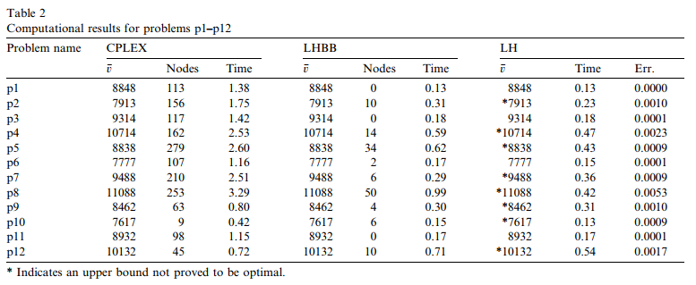
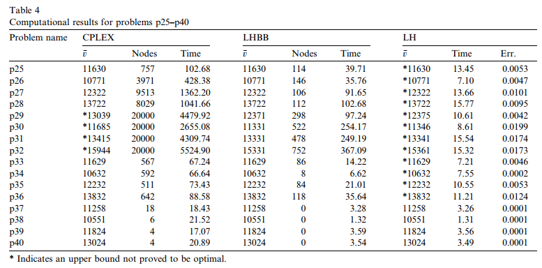

# CFLP

## 算法结果
| 算法一平均代价|算法二平均代价|算法一+算法二混合使用平均代价|
|:--:|:--:|:--:|
|19485.1831 |18222.01408|16684.84507|

- 平均代价指71个样例的代价平均数
- 具体答案在results里面
- 具体代码在code里面

---
## 算法一 

第一个方法是贪婪算法+随机替换，
主要的思路是随机生成一列总容量恰好可以满足所有客户需求的工厂序列，然后将顾客随机放入一个能够满足此顾客需求的工厂生成初始解，之后，随机抽取顾客进行交换，如果新生成的解更好，则接收该答案，否则就抛弃。

这个思路类似于本地搜索，属于比较盲目的随机交换。交换的停止条件为连续若干次没有发现更优的解。

由于在交换顾客的时候没有变更工厂状态，所以在这种算法下对于工厂的选择比较重要，如果选择的开放工厂列表很差可能只能得到一般的解。

主要代码如下：
```c++
bool CFLP::greedy(const vector<float> customerDemand, const
    vector<pair<float, float>> facilityVec, const vector<vector<float>> serviceCost)
{   
    int facilityNum = facilityVec.size();
    vector<bool> isFacilityOpened(facilityNum,false);
    //记录工厂开启情况

    int customerNum = customerDemand.size();
    vector<pair<bool,int>> assignTo(customerNum,pair<bool, int>(false,0));
    //记录每个消费者被分配的情况，当bool为false时表示没有分配

    //计算总需求
    float totalDemand = 0;
    for (float demand : customerDemand) {
        totalDemand += demand;
    }

    //随机找n个工厂使得工厂容量总和大于客户需求
    int totalCap = 0;
    int openFacilityNum = 0;
    clock_t start, end;
    start = time(NULL);
    while (totalCap < totalDemand) {
        int random = rand() % (facilityNum-openFacilityNum);
        //在未开启的工厂里面开启第random个工厂
        for (int i = 0; i < isFacilityOpened.size();i++) {
            if (isFacilityOpened[i]==false&&random != 0) {
                random--;
            }
            else if (isFacilityOpened[i] == false && random == 0) {
                //开启工厂
                isFacilityOpened[i] = true;
                //增加容量
                totalCap += facilityVec[i].first;
                openFacilityNum++;
                break;
            }
        }
        end = time(NULL);
        double dur = end - start;
        //最多尝试2秒
        if (dur > 2) {
            cout << "init solution failed" << endl;
            return false;
        }
    }

    //先生成一个可行的初始解
    for (int i = 0; i < customerNum; i++) {
        //将未分配的客户插入还能接受该客户的工厂
        if (assignTo[i].first == false) {
            //i为顾客ID
            clock_t start, end;
            start = time(NULL);
            int randomSeletedFacility = getRandomNumOpenFacility(isFacilityOpened);
            while (true ){
                if (unusedSpaceInFacilityNo(randomSeletedFacility, facilityVec, assignTo, customerDemand) >= customerDemand[i]) {
                    assignTo[i].first = true;
                    assignTo[i].second = randomSeletedFacility;
                    break;
                }
                randomSeletedFacility = getRandomNumOpenFacility(isFacilityOpened);

                end = time(NULL);
                double dur = end - start;
                //最多尝试2秒
                if (dur>2) {
                    cout << "init solution failed" << endl;
                    return false;
                }
            }
        }
    }

    /*下面进行随机交换，如果超过工厂容量则随机选出一位已分配的顾客出来*/
    int swapFailTimes=0;
    while (true) {
        //cout << "swap times:" << swapTimes << endl;
        if (swapTwoCustomer(assignTo, isFacilityOpened, serviceCost, facilityVec, customerDemand)) {
            swapFailTimes = 0;
        }
        else {
            swapFailTimes++;
        }
        if (swapFailTimes > 500) {
            break;
        }
        
    }
    cout << "greedy algorithm finished" << endl;
    return true;
}
```

有趣的是，这个算法对于部分测试样例表现的比较出色，并没有因为他的简单而错过答案。下面可以看到测试结果和网上的论文的测试数据相差在百分之十左右，甚至出现了更优的答案。
网上的测试结果：


```
本地测试结果：
p1:
cost:9655
time: 3.02811
1 0 1 1 1 1 0 1 1 0 
0 8 5 5 3 8 2 4 4 5 4 8 0 2 8 3 4 0 4 7 3 8 5 4 2 5 3 5 0 5 2 5 0 0 4 4 4 3 0 4 3 8 3 5 7 0 4 0 7 3 

p2:
cost:8759
time: 2.89817
1 1 1 1 1 0 0 0 0 1 
2 2 1 9 3 0 2 4 4 1 9 0 3 2 0 3 4 0 9 4 3 4 9 4 2 2 1 1 0 1 2 9 0 3 9 4 4 3 3 4 1 0 3 2 4 0 4 0 4 0 

p3:
cost:9747
time: 3.53127
1 1 0 1 1 0 1 1 1 0 
0 8 1 6 3 8 4 4 4 1 4 8 3 3 8 3 4 0 6 7 3 8 6 4 1 6 1 6 0 1 6 6 0 3 4 4 4 3 0 4 1 8 3 6 7 0 6 0 4 0 

p4:
cost:11261
time: 3.50581
1 1 1 1 1 0 0 0 0 1 
2 2 1 9 3 0 2 4 4 1 9 0 3 2 0 2 4 0 9 4 3 4 9 4 2 2 1 1 0 1 2 9 0 3 9 4 4 3 0 4 3 0 1 2 4 0 4 0 4 3 

p5:
cost:8678
time: 3.31075
1 1 1 1 1 0 1 0 1 1 
8 8 1 6 3 8 2 4 4 1 9 8 3 2 8 3 2 0 9 4 3 8 6 4 2 6 1 1 0 1 2 6 0 3 9 4 4 3 0 4 1 8 1 6 4 0 2 3 4 0 


```

让人遗憾的是，这个算法并非万能的，此算法有其局限性，特别是在测试样例p25~p40的时候翻车了。

网上的结果：


```
本地的测试结果：
p25:
cost:22974
time: 18.7898
1 0 0 0 1 0 0 0 0 0 0 0 0 0 0 0 0 0 0 0 1 0 0 0 1 1 0 0 0 1 
20 25 20 29 20 25 4 24 20 0 24 0 4 20 4 20 20 0 29 25 0 0 24 4 24 20 0 24 24 24 29 25 29 25 20 20 24 24 4 25 0 20 24 29 24 0 29 20 25 20 29 4 25 0 4 20 0 25 4 20 0 24 20 25 0 25 29 0 24 24 4 20 0 0 24 20 24 20 4 24 20 25 20 0 4 0 0 4 20 29 20 24 25 25 25 24 4 4 29 4 20 25 25 25 4 29 4 25 4 20 0 0 25 0 25 25 24 24 24 24 25 4 25 20 4 4 25 24 4 29 0 25 24 29 4 20 4 29 4 0 0 20 20 0 20 29 25 0 25 24 

p26:
cost:26619
time: 19.5443
0 0 0 0 1 0 1 0 1 0 0 1 0 0 0 0 0 1 0 0 0 1 0 0 1 0 0 0 0 1 
8 29 6 4 8 24 4 24 8 17 24 8 8 8 4 8 8 11 29 11 8 4 24 4 29 8 17 24 24 29 29 11 6 29 8 8 24 24 4 11 11 8 24 8 24 17 4 11 29 17 29 4 11 11 6 8 8 11 11 8 17 24 8 11 17 11 24 17 24 24 6 6 24 8 24 8 24 8 4 24 8 17 6 11 11 11 11 4 8 24 17 24 4 11 4 24 4 4 21 6 6 4 11 11 4 29 4 11 11 8 11 17 4 17 24 21 24 24 24 24 11 6 11 8 8 4 11 29 4 29 11 11 24 29 8 8 4 29 4 11 17 8 8 11 8 11 11 24 4 29 

p27:
cost:29892
time: 19.5165
0 0 0 0 1 0 0 1 0 1 0 1 0 1 0 0 0 0 0 1 0 0 0 0 0 0 0 1 0 0 
13 27 4 19 13 11 4 9 19 11 9 13 13 13 4 19 7 11 11 11 4 4 9 4 9 13 19 9 9 9 27 11 4 27 13 13 9 9 4 7 11 11 9 13 9 7 4 13 27 13 27 4 19 11 13 13 7 11 27 19 11 27 13 11 11 27 9 27 9 9 4 13 11 7 9 13 9 19 4 9 13 11 13 7 11 11 7 4 13 27 19 9 19 27 19 9 19 4 27 4 19 19 7 11 7 11 4 11 19 19 19 19 27 11 11 27 9 9 11 9 11 13 27 13 19 4 11 9 7 4 7 27 9 9 19 7 4 9 13 11 11 4 13 11 13 27 11 11 19 27 

```
一看，居然是最优解的两三倍之多。经过仔细查阅源数据，发现这一组的数据有一个特点，就是他的工厂开放的代价不高，但是服务代价极高，而按照上面的算法就可能面临初始开放工厂选址的战略性错误，因为上面的优先考虑尽可能少的开放工厂数量以节约开放成本，而对于服务成本远高于开放成本并没有纳入考虑范围。因此对于选择初始可行解就需要加入服务成本的考量。同时为了提高匹配的成功率，顾客在选择加入哪个工厂时，应该对服务成本最小的有剩余空间的工厂提高选择概率。

---
## 算法二

对之前的初始解生成方式进行修改，首先找出最近(即服务成本最低)的工厂和最近的还有空闲位置的开放工厂，如果所有的开放工厂都没有位置，则将最近的未开放工厂开放，如果最近的工厂恰好等于最近的有空闲位置的工厂的话，则将一个顾客加入该工厂。如果最近的工厂没有位置，则三分之一概率开放新的工厂，三分之二概率添加到有空余位置的开放工厂。

```c
bool CFLP::improvedGreedy(const vector<float> customerDemand, const 
    vector<pair<float, float>> facilityVec, const vector<vector<float>> serviceCost, int startNo)
{
    int facilityNum = facilityVec.size();
    vector<bool> isFacilityOpened(facilityNum, false);
    //记录工厂开启情况

    int customerNum = customerDemand.size();
    vector<pair<bool, int>> assignTo(customerNum, pair<bool, int>(false, 0));
    //记录每个消费者被分配的情况，当bool为false时表示没有分配

    //每十个里面从第startNo个开始分配服务工厂
    for (int i = 0; i < customerNum / 10; i++) {
        for (int j = startNo; j < 10+startNo; j++) {
            int customerPosTemp = j % 10+10*i;

            //优先选择最近的开放工厂,如果最近的工厂没有开放，则一定概率开启该工厂
            int nearestUnOpenFacility = findNearestUnOpenFacility(customerPosTemp,isFacilityOpened, serviceCost);
            int nearestAvailbleOpenFacility = findNearestAvailableOpenFacility(customerPosTemp, 
                isFacilityOpened, serviceCost, facilityVec, assignTo, customerDemand);

            assignTo[customerPosTemp].first = true;
            //没有工厂可以接纳
            if (nearestAvailbleOpenFacility == -1) {
                assignTo[customerPosTemp].second = nearestUnOpenFacility;
                isFacilityOpened[nearestUnOpenFacility] = true;
            }
            else if (serviceCost[nearestUnOpenFacility][customerPosTemp]  
                <serviceCost[ nearestAvailbleOpenFacility][customerPosTemp]) {
                assignTo[customerPosTemp].second = nearestAvailbleOpenFacility;
            }
            else {
                //2/3概率添加到现有工厂，1/3概率新开工厂
                int ran = rand() % 3;
                if (ran == 0) {
                    assignTo[customerPosTemp].second = nearestUnOpenFacility;
                    isFacilityOpened[nearestUnOpenFacility] = true;
                }
                else {
                    assignTo[customerPosTemp].second = nearestAvailbleOpenFacility;
                }
            }

        }
    }
    //初始解生成完毕
    /*下面进行随机交换，如果超过工厂容量则随机选出一位已分配的顾客出来*/
    int swapFailTimes = 0;
    while (true) {
        //cout << "swap times:" << swapTimes << endl;
        if (swapTwoCustomer(assignTo, isFacilityOpened, serviceCost, facilityVec, customerDemand)) {
            swapFailTimes = 0;
        }
        else {
            swapFailTimes++;
        }
        if (swapFailTimes > 500) {
            break;
        }
    }
    
    return true;
}


```

同时修改交换策略，保持随机性的同时加入服务成本低优先的导向。不过这个贪婪策略最后证明似乎效果一般，并没有明显改善，反而有时可能出现比原解更差的收敛结果，因此在这里不再赘述。

修改之后，整体上有所改善，总体代价减少百分之七左右，但由于算法仍然受初始开启工厂列表的影响，所以有部分解的该进幅度极小甚至负改进，因此最优的策略是综合两个算法使用，取更优值，可以做到两个算法的取长补短，整体改善效率在十几个点以上。具体结果可见readme开头。
